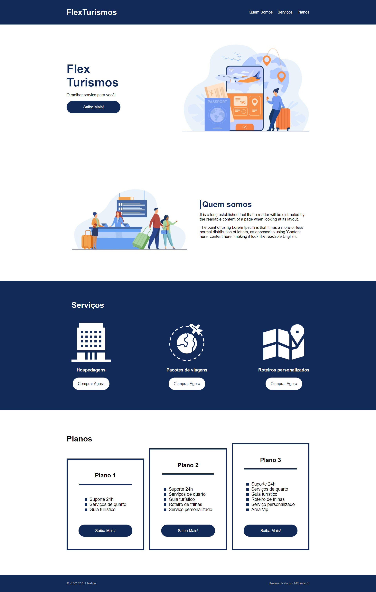

<h1> flex-turismo </h1>

<h2>Descrição</h2>

Projeto criado durante estudos de posicionamento de elementos com Flexbox em CSS. 
 
Foi adicionado ao projeto algumas funcionalidades, tais como o botão "hamburger" para a versão mobile,  
animação ao passar o mouse no menu e nos botões da page. 
 
Página simples, porém totalmente responsiva  

<a href="https://mqsoares.github.io/flex-turismo/" target="_blank">Confere aqui</a>

<h2>Tecnologias</h2>
<ul>
  <li>HTML</li>
  <li>CSS</li>
  <li>JavaScript</li>
</ul>

<h2>Features</h2>
<ul>
  <li>Responsivo</li>
  <li>Flex Box</li>
</ul>

<h2>Preview DESKTOP</h2>
 

  

<h2>Preview MOBILE</h2>
 

  
    

<h2> 
<a href="https://www.linkedin.com/in/mq-soares" target="_blank">Meu Linkedin</a>
</h2>
